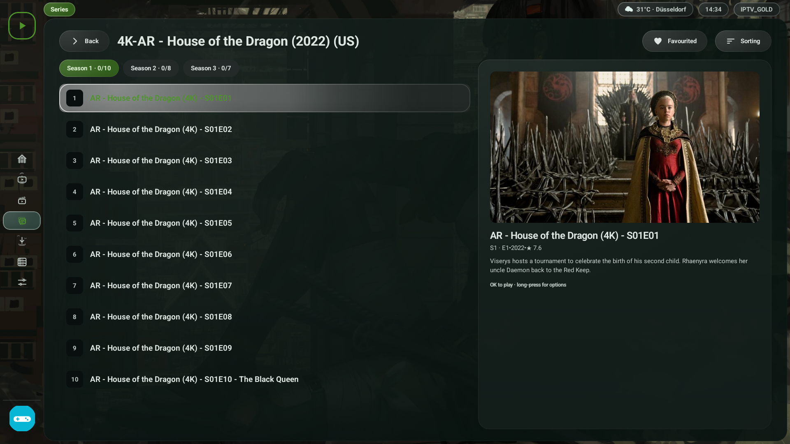
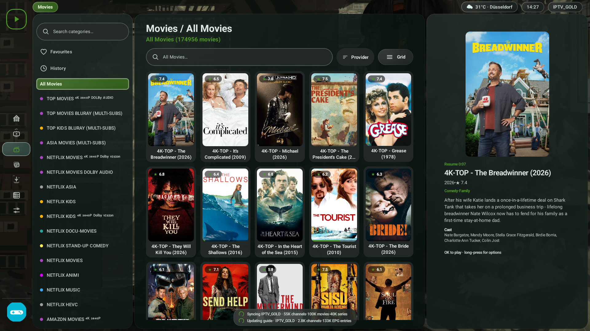
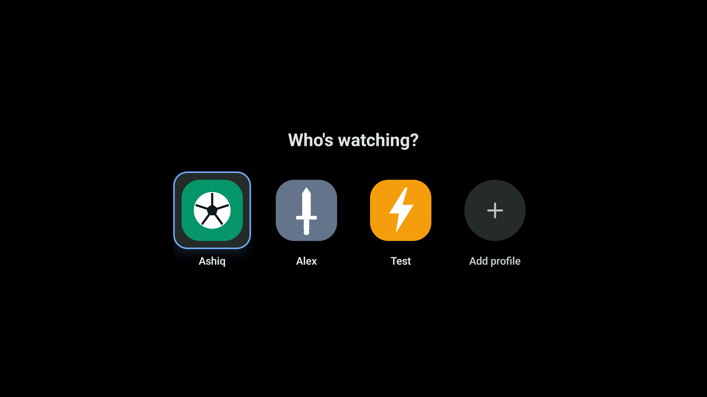
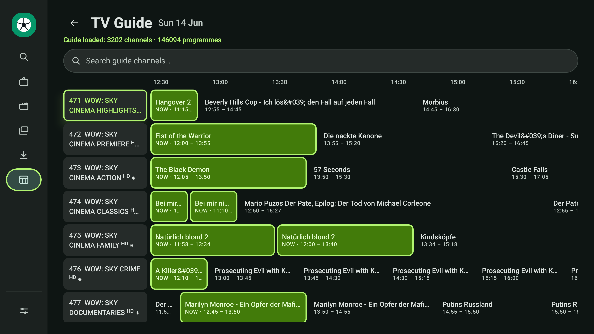

<p align="center">
  
</p>

<p align="center">
  <b>Your own IPTV player for Android TV</b><br>
  <sub>Fast · modern · remote-first — bring your own M3U, Xtream or Stalker (MAC) sources</sub>
</p>

<p align="center">
  
  
  
  
  
  
  <a href="https://hosted.weblate.org/engage/owntv/">
    
  </a>
</p>

<p align="center">
  <a href="https://github.com/ahXN00/OwnTV/actions/workflows/android.yml">
    
  </a>
</p>

---

OwnTV is a native **Android TV** IPTV **player** built with Kotlin, Jetpack Compose for TV, and a
**dual playback engine** — **libmpv (FFmpeg)** for movies/series and maximum compatibility, **ExoPlayer
(Media3)** for near-instant Live TV. It's a *player only* — you bring your own Xtream login, M3U playlist
(by **URL or a local `.m3u`/`.m3u8` file** on the device), or **Stalker/Ministra portal (Portal URL + MAC,
with optional Serial Number, Device IDs, and Signature)**, and OwnTV gives you a fast, modern,
remote-first way to browse and watch them.

> ⚠️ OwnTV does **not** provide any channels, playlists, subscriptions, streams, or media content.
> You are responsible for adding your own legally accessible sources.

This is an **open-source** project — the code is original (not derived from any other app) and was
**built with the help of AI**. **Contributions are welcome**: clone, build, and test it freely. It
targets **Android TV only** (leanback launcher, D-pad-first UI).

> ### 📖 New here? Read the [**User Guide & Hidden Features →**](extras/USER_GUIDE.md)
> Long‑press to favourite, **Left** for the channel list (**Left** again to browse categories) and
> **Right** for recently watched, the
> MPV/EXO toggle's **compatibility mode**,
> catch‑up from the Guide, startup landing, A/V‑sync — all the remote shortcuts in one place.

---

## 💬 Community

Questions, ideas, bug reports — or just want to follow along? **Join the OwnTV Telegram group:**

### 👉 [t.me/owntvplayer](https://t.me/owntvplayer)

Scan to join from your phone:

<a href="https://t.me/owntvplayer"></a>

---

## ✨ Features

### 🎬 Playback
- **Dual engine** — libmpv (FFmpeg) for max compatibility + ExoPlayer for instant Live TV; per-channel toggle and automatic VOD fallback between them
- Zero-copy **4K HDR** direct rendering · opt-in **auto frame rate** (off by default; 24/25/50/60 fps display matching, with the rate measured when a live stream doesn't declare one, and Android TV's own *Match content frame rate* preference respected) · **live buffering you control** (Live latency drives the real buffer, and it, the Pre-buffer gate and the choice of player can each be set per playlist) · context-aware channel zapping (dedicated CH± always works in the Live TV/catch-up player and stays in Favorites, History, All or the opened category) · **self-correcting surround sound** (Auto/Stereo only/Surround, with an audio-output watchdog that falls back to stereo if your TV or soundbar can't actually play it, a clean ExoPlayer video restart, and direct saved-position starts that keep working surround intact when Home resumes a film) + 150% volume boost
- **Subtitles** — text (SRT/ASS), image (PGS/VOBSUB/DVB), closed captions, preferred-language auto-selection and independent font/style controls, plus OpenSubtitles search and local files; dedicated OpenSubtitles settings sign in on one panel — username, password and optional API key/Worker together — filled in on the TV or handed over from another device by QR + PIN
- Resume prompts, next-episode auto-play, mini-player/PiP, **audio-only mode**, confirmed radio/audio-only item labelling, and a live codec/resolution/HDR stream-info overlay
- **Behaves like a TV app** — remote/headset/assistant transport keys via a system media session, and audio focus that ducks for a notification instead of pausing your film
- **Diagnostics you can send** — an Error log (Settings → App) holding the last crash *and* recent playback failures and events, "Report this stream" from the info overlay, optional detailed trace, and a one-press export to `Download/owntv-playback-report.txt`

### 🧭 Browse
- **Continue Watching** home with TMDB-enriched previews; Live / Movies / Series / Downloads / Guide sections
- **Now Trending** Home showcase — current TMDB movie/series rankings matched to titles your active provider
  can actually play, with trailers, full cast/details, provider language/quality/season signals, and flexible
  movie/series balancing; a dedicated Home setting turns it on/off, and it stays first when enabled
- Per-profile customizable rows, Favorites & History, bulk rename rules, custom combined categories,
  All/Visible/Hidden customization filters, inline + global search, and a multi-playlist switcher;
  when several playlists are merged, compact provider labels identify categories and items throughout
  Live TV, Movies, Series, the Guide and player channel overlays
- Per-section panel widths for Live TV, Movies and Series, including a 0% option that completely hides
  the preview/poster panel, plus an independent 10–90% channel/timeline split for the Guide; every custom
  layout must keep an exact 100% total
- **Episode grid** — browse a show by episode stills instead of text rows, with a show-artwork and
  episode-number fallback for episodes TMDB can't match; a whole show's episode details arrive in a
  single request
- **TMDB** posters, plots, cast photos and lighter fullscreen in-app trailers **in 40 languages**; scales to ~50k channels / ~168k movies with priority + incremental syncing
- Dedicated **Metadata** settings show minute/hour/day shared allowance and support a personal TMDB key or self-hosted Worker, including remote hand-over over LAN (QR + PIN)
- Bring your own **free TMDB key** for unlimited metadata — send it from another device (phone, tablet or PC) over LAN (QR + PIN) instead of typing 32 characters with the remote; the built-in shared service works with no setup and gives every device a fair daily share

### 📥 Sources & EPG
- App-wide **custom DNS** — System, Google, Cloudflare, Quad9, custom DNS or DNS-over-HTTPS; the selected resolver persists across restarts
- **Xtream**, **M3U** (typed playlists), and **Stalker/Ministra** portals, including optional advanced device identification; add any source from another device (phone, tablet or PC) over LAN (QR + PIN) — including uploading an `.m3u` file straight from the computer
- XMLTV **TV Guide** grid with a live-refreshing amber Now marker positioned around 37.5% across the view,
  **Catch-up TV** (up to 7 days) + live rewind, auto EPG matching, multiple guide sources
- **Catch-up works without a guide** — a **Catch-up** category listing every channel with an archive, plus **Go back to…** to jump to a time (or an exact day/hour/minute) instead of holding rewind
- **Catch-up plays on** — a finished programme continues to the next one in the guide, and hands over to the live channel once you have caught up with the present
- **Clock in every player**, and while replaying a recording a second one showing when the programme originally aired, with a matching **Playing / Then** guide row
- **Guide time offset** — correct a guide published in another time zone, globally or per channel
- Optional **guide channel logos** — per EPG source, use that feed's own logos instead of your playlist's
- M3U extras honoured: per-item HTTP headers on live, movie and series entries (`#EXTVLCOPT` / `#EXTHTTP` / `#KODIPROP` / URL suffix) and the `append` / `shift` / `flussonic` / `xc` catch-up styles
- **Protected (DRM) channels** — Widevine and ClearKey over DASH/HLS, read from the playlist's `#KODIPROP` licence properties; uses the CDM built into the device, so there is nothing to configure and no licence to buy

### 👥 Profiles & Downloads
- Multiple profiles with own favorites/history/resume, PIN locks, and a "Who's watching?" gate; Kids mode hides adult provider folders/items and TMDB adult results throughout browsing, Guide and playback, while normal profiles keep the full catalogue
- Per-profile startup can open Home, resume last channel, enter Live Favorites, or immediately play a chosen Live channel selected with a searchable TV-friendly picker; profile selection and PIN locks are always respected
- Offline movies & episodes — pause/resume/retry, queue groups + storage bar, live poster status strip

### 🎨 Settings & Robustness
- Material 3 theming & accent, a user-chosen **Focus highlight** (colour via presets/palette/hex plus
  four ring thicknesses, applied app-wide in both solid and glass materials), unified browse panels,
  compact navigation, optional solid-mode Ambient Glow,
  and interaction-aware **Glass Effect** with a dedicated preview-led settings page, Ultra
  Clear/Clear/Balanced/Tinted/Opaque/Custom presets, one-press All-surface selection, adaptive readability
  and real frost levels over your own background photo; searchable settings,
  sidebar/category customization, adjustable panel widths, external player, weather chip
- **Font customization** with 60%–140% main-app text sizing, independent 50%–120% popup text and popup-box
  sizing, and separate main-interface/popup choices from the bundled font catalog plus system Monospace;
  settings are preserved in backup and restore, while subtitle font and styling remain independently configurable
- Dedicated **Remote Shortcuts** — assign short or long presses of spare colour, number, channel and media
  keys to 25 navigation, browsing and playback actions. Essential D-pad/Back/OK/volume/Home/power controls
  stay protected, fullscreen number entry still changes channels, and the shipped CH+/−/Rewind/Fast-forward
  paging setup remains the default
- **24 complete interface languages** with System default, an in-app searchable language picker, RTL-aware navigation, and a language-first welcome flow on fresh installations
- **Backup & Restore** locally or over Wi-Fi — a single `.own` file carrying your profiles, sources, complete Settings choices and arrangements, background image and downloaded subtitles, optionally encrypted end to end with your own password (older `.json` backups still restore). Android's automatic backup is deliberately disabled, so app data only ever leaves the device through this screen — secrets ride only when you set a backup password. Plus in-app updates; memory-safe buffers, no-ANR threading, auto-reconnect, resilient imports & offline detection

📖 Full details: **[player reference →](extras/player.html)** · **[user guide →](extras/USER_GUIDE.md)**

---

## 📸 Screenshots

<table>
  <tr>
    <td align="center"><br><sub>Home — Continue Watching</sub></td>
    <td align="center"><br><sub>Series — episodes</sub></td>
  </tr>
  <tr>
    <td align="center"><br><sub>Live TV — preview playing</sub></td>
    <td align="center"><br><sub>Movies</sub></td>
  </tr>
  <tr>
    <td align="center"><br><sub>"Who's watching?" profile gate</sub></td>
    <td align="center"><br><sub>Downloads</sub></td>
  </tr>
  <tr>
    <td align="center"><br><sub>Settings</sub></td>
    <td align="center"><br><sub>TV Guide (EPG)</sub></td>
  </tr>
</table>

More in **[extras/screenshots/](extras/screenshots/)** — playlist management, EPG & profile settings.

---

## 🧱 Tech stack

| Area | Choice |
|------|--------|
| Language | Kotlin 2.4.10 (no `kotlin-android` plugin) |
| Build | AGP 9.3.2 / Gradle 9.7.1, KSP2 2.3.11 |
| UI | Jetpack Compose for TV (`androidx.tv:tv-material` 1.1.0), Compose BOM 2026.08.00 |
| Media | **libmpv** (FFmpeg) — `dev.jdtech.mpv:libmpv` · **ExoPlayer/Media3** 1.11.0 (Live TV + image subs) |
| Database | Room 2.8.4 + Paging 3.5.1 + FTS4 (WAL) |
| DI | Koin 4.2.2 |
| Networking | OkHttp 5 (`okhttp-android`) |
| Images | Coil 3.6.0 |
| Preferences | DataStore |

`minSdk 26`, `targetSdk 36`, `compileSdk 37`, `applicationId tv.own.owntv`.

> **Build note:** there is no `kotlin-android` plugin. AGP 9 ships its own Kotlin, but the Compose
> compiler plugin pulls the Kotlin Gradle plugin up to the `kotlin` version pinned in
> `gradle/libs.versions.toml` — that is what actually compiles the app, so keep the Compose compiler
> plugin on exactly that version. KSP versions its own way and does **not** have to match that number
> — KSP2 2.3.11 is the current release and drives Room's codegen against Kotlin 2.4.10 without issue.

## ⚙️ How it works (backend)

- **Parsing & sync** — M3U playlists are line-streamed and Xtream `player_api` JSON is read with
  `android.util.JsonReader`, so huge provider payloads are never fully buffered. `SyncManager` does a
  clear-then-insert refresh in ~500-row chunked transactions with Flow progress and cancellation.
- **Storage** — a 27-entity Room schema: profiles & sources (`ProfileSourceCrossRef` for sharing),
  content (categories/channels/movies/series/seasons/episodes), per-profile favorites/history/progress/
  downloads, EPG channels/programmes, external-subtitle cache/selection/timing/links, and FTS4 search
  tables. Totals come from indexed `COUNT` queries.
- **Lists** — Paging 3 with a bounded `maxSize` keeps memory flat across 50k+ item lists.
- **EPG** — bulk XMLTV is stream-parsed (gzip-aware) into a rolling now→+48h window and pruned.
- **Player** — two engines behind a small `PlaybackEngine` interface: **libmpv** (movies/series, and any
  live stream ExoPlayer can't open) and **ExoPlayer/Media3** (Live TV — instant HLS). Live "promotes" the
  running preview straight to full-screen (no reload); the shell hoists the active surface across full ↔
  mini-player. Player state is published as `StateFlow`s for the Compose HUD.
- **DI** — Koin modules (`appModule`, `databaseModule`, `dataModule`, `playerModule`).

### Project layout

This repository is the **Android TV app**. The engine underneath it — database, sync, parsers, EPG,
backup, settings storage, the playback engines and every translated string — lives in a separate
core library that a future mobile app will share.

```
OwnTV/  (this repo)
tv.own.owntv/
├── player/      the TV player HUD, surfaces and mini-player
├── ui/          theme + reusable components (focus surface, cards, state views, avatars)
├── features/    setup, shell, live, movies, series, search, downloads, epg, profiles, settings
└── di/          Koin modules

OwnTV_Core/  (separate repository, published as tv.own.owntv:core / :player-core)
├── core/        database (Room), network, parser (M3U/Xtream/XMLTV), stalker (MAC portal), repository, sync, util, strings
└── player-core/ libmpv + ExoPlayer engines (PlaybackEngine), fallback ladder, watchdogs, diagnostics
```

## 📚 Docs & design (`extras/`)

- 📄 **[Complete Feature Document](extras/OwnTV_Complete_Brief_Plan_With_Logo.docx)** — the full
  as-built feature reference: playback, browse, EPG, profiles, architecture, and tech stack.
- 📺 **[Player design reference](extras/player.html)** — an interactive Material 3 mockup of the player UI.
- 🖼️ `extras/logo.png` — the OwnTV logo.

## 📥 Installing (Fire TV / Android TV)

Grab the signed APK from the [**latest release**](https://github.com/ahXN00/OwnTV/releases/latest) and
sideload it. A fixed link always points at the newest signed build:

```
https://github.com/ahXN00/OwnTV/releases/latest/download/OwnTV.apk
```

- **Fire TV** — install the **Downloader** app (by AFTVnews) from the Amazon Appstore, then enter the
  **Downloader code `4308278`** (or [`aftv.news/4308278`](https://aftv.news/4308278), which always
  points at the latest signed `OwnTV.apk`). Enable *Apps from Unknown Sources* if prompted.
- **Android TV / Google TV** — the **Downloader** app is also on Google Play, so the same code
  **`4308278`** works here too. (If Downloader doesn't show in search, open the Play Store on the TV —
  you can reach it via *Settings → Apps → See all apps → Show system apps → Google Play Store* — and
  install it from there.) Or just sideload the APK with your tool of choice (*Send files to TV*, a USB
  drive, or `adb install OwnTV.apk`).

> Only install the APK from this repository's official Releases (or the `…/releases/latest/download/OwnTV.apk`
> link above). It's the build signed by this project's CI — third-party re-hosts aren't endorsed.
>
> Releases ship **two APKs**: `OwnTV-vX.X.X.apk` / `OwnTV.apk` (arm: `arm64-v8a` + `armeabi-v7a` — for
> all real Fire TV / Android TV devices, and what the Downloader code fetches), and
> `OwnTV-x86_64-vX.X.X.apk` (for emulators / rare Intel boxes). Real devices always want the arm build.

## 🛠️ Building & running

> Only needed if you want to build from source. Most people can just **[install the ready-made APK](#-installing-fire-tv--android-tv)** instead — no build tools required.

> **One extra step before the first build: a GitHub token.** Half of the app — the database, the
> playlist importing and the whole playback engine — lives in the separate
> [OwnTV_Core](https://github.com/ahXN00/OwnTV_Core) repository and is pulled in as a library from
> GitHub Packages. That registry always asks who you are, even for public packages, so a clone of
> this repo fails Gradle sync with a `401` until you do step 2 below. Installing and using the
> ready-made APK needs none of this.

**What you need first**
- **[Android Studio](https://developer.android.com/studio)** (a recent version that supports AGP 9.x) — this bundles the JDK and Android SDK, so you don't install those separately.
- A build target: either a real **Android TV / Fire TV** device (with USB or wireless debugging turned on), or an **Android TV emulator** created from Android Studio's Device Manager.

**Steps**
1. **Get the code** — click the green **Code** button on GitHub → *Download ZIP* (and unzip it), or run `git clone https://github.com/ahXN00/OwnTV.git`.
2. **Let Gradle read the core library** — create a [personal access token (classic)](https://github.com/settings/tokens) with the single scope **`read:packages`**, then add it to `~/.gradle/gradle.properties` (`C:\Users\<you>\.gradle\gradle.properties` on Windows) — never inside the project:
   ```properties
   gpr.user=your-github-username
   gpr.token=ghp_yourtokenhere
   ```
3. **Open it** — in Android Studio choose **Open**, pick the project folder, and wait for the first **Gradle sync** to finish (it downloads dependencies; give it a few minutes the first time).
4. **Pick the right build variant** — open **Build Variants** (left sidebar) and choose the flavor that matches your target:
   - **`standard`** — real TV/phone/Fire TV devices and arm emulators (`arm64-v8a` + `armeabi-v7a`)
   - **`x86_64`** — x86_64 emulators only
   - This matters: the native libmpv player only loads on a matching ABI, so the wrong choice = no playback.
5. **Press Run** (▶) with your device/emulator selected. The app installs and launches. It shows up in the **TV launcher** on Android TV, and as a normal app icon on phones/tablets too (minimum **Android 8.0 / API 26**).

**Prefer the command line?** From the project folder run `./gradlew assembleDebug` (use `gradlew.bat assembleDebug` on Windows). The APK lands in `app/build/outputs/apk/`.

**First launch** — choose the app language (or keep **System default**) before pressing **Get Started**. The modern four-page onboarding then takes you through the disclaimer, profile/backup choice, and adding a source (M3U, Xtream, or Stalker/MAC portal). You can also restore a local backup or send one from another device. Change the interface language later under **Settings → Look & Feel → Language**; this is separate from the TMDB metadata-language setting. After a source imports, browse from the sidebar and open the **Guide** for the EPG.

**Tested on:** a real **TCL Google TV**, and the **Android Studio emulator** (both the Android TV and Google TV system images).

## 🤝 Contributing

Contributions, bug reports, and ideas are welcome — open an issue or a pull request. Please keep the
project's player-only, bring-your-own-source positioning, and match the existing code style.

<!-- i18n-contribution:start -->
## Help translate OwnTV

If your language is already available, contribute interface translations across OwnTV's six Android resource components on [Hosted Weblate](https://hosted.weblate.org/projects/owntv/). If it is not listed, [open a language request ticket](https://github.com/ahXN00/OwnTV/issues/new?template=feature_request.yml&title=%5BLanguage%5D%20Add%20) first. A maintainer will review the request, register the locale, and prepare its base translation files on Hosted Weblate. Once the language appears on Hosted Weblate, you can start translating it there. The strings themselves live in [OwnTV's core library repository](https://github.com/ahXN00/OwnTV_Core), together with the language contributor guide covering identifiers, validation, and promotion policy.
<!-- i18n-contribution:end -->


## 🙏 Credits


Movie & series metadata and trailers are provided by [TMDB](https://www.themoviedb.org/).
**This product uses the TMDB API but is not endorsed or certified by TMDB.**


Subtitle search & download is powered by [OpenSubtitles.com](https://www.opensubtitles.com/).
**This product uses the OpenSubtitles API but is not endorsed or certified by OpenSubtitles.** You sign
in with your own OpenSubtitles account and are subject to their terms and download quotas.

### ▶️ Playback engines

- **[mpv](https://mpv.io/)** (via [libmpv](https://github.com/mpv-android/mpv-android), built on
  [FFmpeg](https://ffmpeg.org/)) — the default engine, for the widest IPTV/codec, audio and HDR support.
- **[Media3 / ExoPlayer](https://github.com/androidx/media)** — the fast-start engine for Live TV
  preview and HLS.

Which of the two starts a stream is yours to set, separately for Live TV and for Movies & Series
(Settings → Video Player): either order, or one engine only with the automatic handover turned off.

### 🧩 Built with

[Jetpack Compose for TV](https://developer.android.com/jetpack/compose) ·
[Room](https://developer.android.com/jetpack/androidx/releases/room) ·
[Koin](https://insert-koin.io/) ·
[OkHttp](https://square.github.io/okhttp/) ·
[Coil](https://coil-kt.github.io/coil/) ·
[ZXing](https://github.com/zxing/zxing) — and the wider Kotlin / AndroidX open-source ecosystem.
Thank you to all their maintainers. See each project for its own license.

## ⚖️ Legal

OwnTV is a media **player** only. It ships with no channels, playlists, subscriptions, or content, and
does not endorse or facilitate access to unauthorized streams. Users are solely responsible for the
sources they add and for complying with the laws and rights that apply to them.

## 📄 License

Released under the **GNU General Public License v3.0 (GPLv3)** — see [LICENSE](LICENSE).

In short: you're free to use, study, modify, and redistribute OwnTV, including commercially — but any
redistributed version (including forks and commercial products built on it) must also be licensed under
GPLv3 and its source made available.

---

<sub>OwnTV is an open-source, player-only project, built with the help of AI.</sub>
